#  Machine Fault Recognition

[](https://www.python.org/downloads/)
[](https://pytorch.org/)
[](https://streamlit.io/)
[](https://www.docker.com/)

An automated, robust machine condition monitoring system designed to classify industrial sounds into normal and abnormal states. Based on the **SEnv-Net** architecture, this project achieves state-of-the-art accuracy using optimized parameter tuning of single MFCC feature extraction.

---

##  Key Highlights

- **High Accuracy:** Achieved exceptional test accuracy across 6 distinct operation states.
- **Real-Time Performance:** Average inference time of **0.08 ms** per sample.
- **Lightweight:** Only **274,310 parameters**, making it suitable for edge deployment.
- **Decoupled Pipeline:** Clean separation between preprocessing, feature extraction, and classification.
- **Web Interface:** Interactive Streamlit dashboard for drag-and-drop audio classification.

---

##  System Architecture

The pipeline follows the philosophy of modeling input representation over increasing network depth.

1.  **Preprocessing:** Spectral gating for noise reduction + 4th-order Butterworth bandpass filter (20 Hz - 20 kHz).
2.  **Feature Extraction:** 40-band Log Mel Spectrogram converted to 40 MFCCs (DCT-II decorrelation).
3.  **Classifier:** A 2D CNN (`AudioClassifier`) featuring 3 convolutional blocks, progressive dropout, and an `AdaptiveAvgPool2d` layer for dimensional stability.

### CNN Visualization

```mermaid
flowchart LR
    %% Global styles
    classDef conv fill:#cce5ff,stroke:#000,stroke-width:2px,color:#000,font-size:16px;
    classDef pool fill:#d4edda,stroke:#000,stroke-width:2px,color:#000,font-size:16px;
    classDef dense fill:#f8d7da,stroke:#000,stroke-width:2px,color:#000,font-size:16px;
    classDef io fill:#fef3c7,stroke:#000,stroke-width:2px,color:#000,font-size:16px;

    %% Nodes with extra spacing (using <br> for height)
    Input["Input<br/>(1×250×40)<br/><br/>"]:::io --> Conv1["Conv2D 32<br/>(5×5)<br/><br/>"]:::conv
    Conv1 --> Pool1["MaxPool<br/>(4×2)<br/><br/>"]:::pool
    Pool1 --> Conv2["Conv2D 64<br/>(5×5)<br/><br/>"]:::conv
    Conv2 --> Pool2["MaxPool<br/>(4×2)<br/><br/>"]:::pool
    Pool2 --> Conv3["Conv2D 128<br/>(5×5)<br/><br/>"]:::conv
    Conv3 --> Adaptive["AdaptiveAvgPool<br/><br/>"]:::pool
    Adaptive --> FC["Fully Connected<br/>(128)<br/><br/>"]:::dense
    FC --> Output["Output<br/>6 Classes<br/><br/>"]:::io

```


---

##  Project Structure

```text
.
├── app.py                  # Streamlit Web Dashboard
├── infer.py                # Batch Inference Script
├── Dockerfile              # Containerization for Deployment
├── data/                   # Test Audio Files (.wav)
├── results/                # Output Results & Metrics
├── src/
│   ├── model/              # CNN Architecture & Saved Weights (.pkl)
│   ├── features_extraction/# MFCC, STFT, LogMel logic
│   ├── preprocessing/      # Noise reduction & Filtering
│   ├── train/              # Training, Testing & Cross-validation
│   ├── dataloader/         # PyTorch Dataset implementation
│   └── requirements.txt    # Project Dependencies
└── Readme.md               # You are here!

```

---

##  Installation & Setup

### Local Setup

1. **Clone the repository:**
```bash
git clone [https://github.com/hagar3bdelsalam/machine-fault.git](https://github.com/hagar3bdelsalam/machine-fault.git)
cd machine-fault

```


2. **Install dependencies:**
```bash
pip install -r src/requirements.txt

```


3. **Download Model Weights:**
Ensure `src/model/model_epoch_75.pkl` is present in the directory.

### Docker Deployment

```bash
# Build the image
docker build -t machine-fault-detector .

# Run batch inference
docker run --rm \
  -v $(pwd)/data:/app/data \
  -v $(pwd)/results:/app/results \
  machine-fault-detector data

```


##  Usage

###  Streamlit Web App

Launch the interactive dashboard to upload audio files and see real-time classification results:

```bash
streamlit run app.py

```

###  Batch Inference

Run inference on all files in the `data/` directory:

```bash
python infer.py

```

Results will be saved to `results/results.txt`.


## Contributors

| <a href="https://avatars.githubusercontent.com/Esraa-Hassan0?v=4"></a> | <a href="https://avatars.githubusercontent.com/hagar3bdelsalam?v=4"></a> | <a href="https://avatars.githubusercontent.com/ahmedkamal14?v=4"></a> | <a href="https://avatars.githubusercontent.com/Safan05?v=4"></a> |
| :-----------------------------------------------------------------------------------------------------------------------------------------------------------------: | :--------------------------------------------------------------------------------------------------------------------------------------------------------------: | :---------------------------------------------------------------------------------------------------------------------------------------------------------: | :----------------------------------------------------------------------------------------------------------------------------------------------------------------: |
|                                                           [Esraa Hassan](https://github.com/Esraa-Hassan0)                                                            |                                                           [Hagar Abdelsalam](https://github.com/hagar3bdelsalam)                                                            |                                                          [Ahmed Kamal](https://github.com/ahmedkamal14)                                                           |                                                            [Abdallah Safan](https://github.com/Safan05)                                                            |


---


##  References

* **SEnv-Net Architecture:** Abd Al-Hattab et al. (2021). *"Rethinking environmental sound classification using convolutional neural networks"*. [Link to Paper](https://doi.org/10.1007/s00521-021-06091-7).
